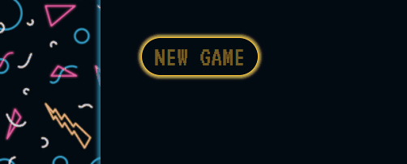
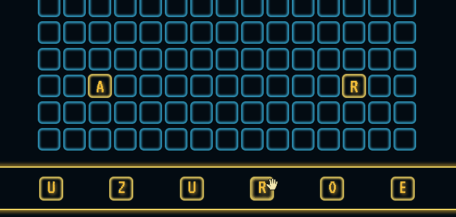
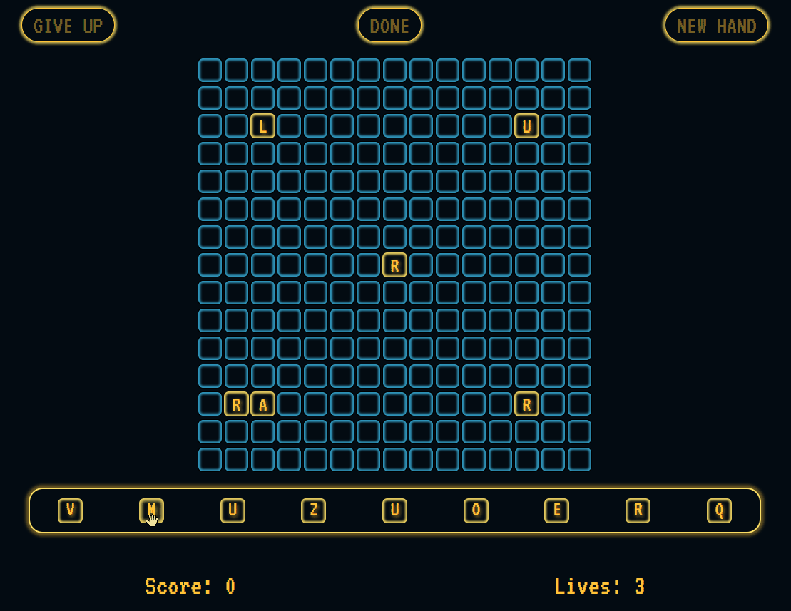
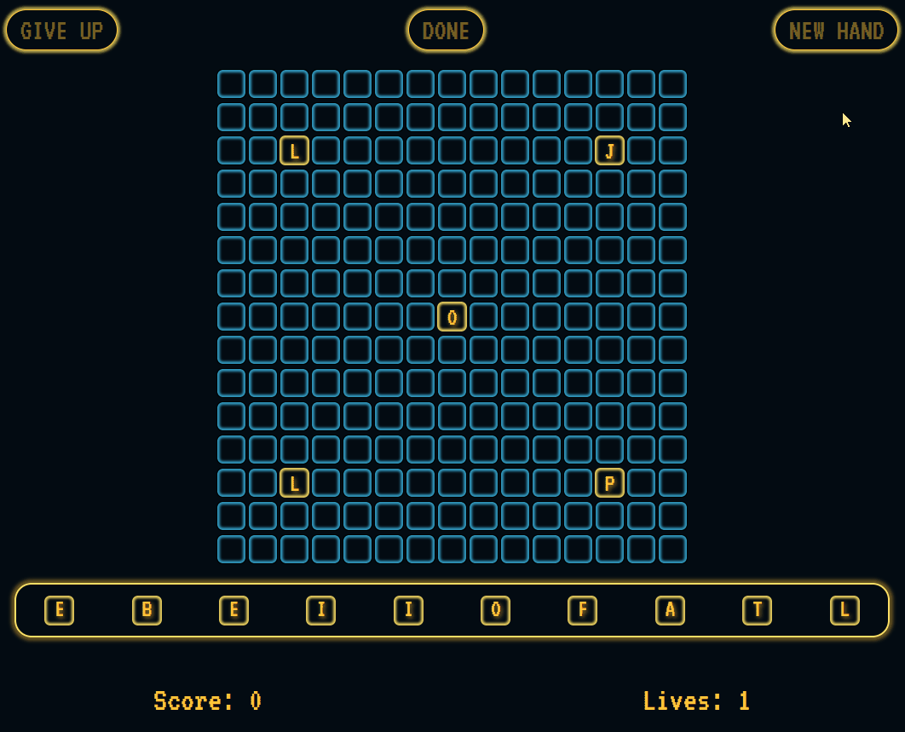
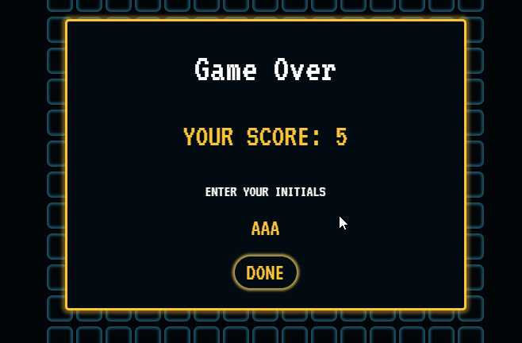

# Mintbean Hackathon Project: Scrobble

## Deployment Links

* Front End: https://pensive-minsky-873ba7.netlify.app/
* Back End: https://scoresv1-atfvujdraq-uc.a.run.app/scores

## Back End API Documentation

The source code for the back end of this project is located in the `/node` directory. The back end consists of an Express server REST API that can perform read and write operations on a MongoDB database. The database is only used to keep track of high scores. 

This Express server was containerized with Docker and hosted on Google Cloud Run.

To run a local version of this server you must have Node.js installed locally. Navigate to the `/node` directory and run the following commands from the console.

```
$ npm install
$ nodemon app
```

### API Endpoints

* `GET '/'` This endpoint returns returns the top 10 high scores across all players
* `GET '/<player-initals>'` This endpoint returns returns the top 10 high scores for the given player.
* `POST '/'` This endpoint is used to add a new score to the database. It accepts a JSON object in the body with the follow format:

```javascript
{
    "username" : String,
    "point_total" : Number
}
```

## Front End Documentation
lorem ipsumlorem ipsumlorem ipsumlorem ipsumlorem ipsumlorem ipsumlorem ipsumlorem ipsumlorem ipsumlorem ipsumlorem ipsumlorem ipsumlorem ipsumlorem ipsumlorem ipsumlorem ipsumlorem ipsumlorem ipsumlorem ipsumlorem ipsumlorem ipsumlorem ipsumlorem ipsumlorem ipsumlorem ipsumlorem ipsumlorem ipsumlorem ipsum

## Player Instructions
The objective of Scrobble is to spell as many words as you can. Each letter tile has a point value assigned to it, like in Scrabble. The more words you spell, the more points you earn. 



To spell a word, click-and-drag a letter tile from your hand to a square on the board. You can only place a tile on an empty square that is vertically or horizontally adjacent to an already placed letter tile. When you start the game, 5 random letter tiles will be placed on the board to get you started.




There are some restrictions with spelling words: You can only spell words from left-to-right, or top-to-bottom. The minimum length for a word is 3 letters.




If you get stuck, and can't spell anymore words you can click the "Get New Hand" button, to return your tiles to the deck and draw 10 more random tiles. Drawing a new hand consume a life, and you only get 3 lives per game. When you run out of lives you can no longer refresh you hand.




When you think you can no longer spell anymore words, press the "Give Up" button. This will end the game and prompt you to enter your initals for a chance to make it onto the leaderboards.



## Meet the Team

### Clay Gilkerson
Clay is an aspiring developer with a passion for learning new technologies and solving interesting problems. He is experienced with C#/.NET and Vue.js, and Currently exploring Node.js and MongoDB.
* [LinkedIn](https://www.linkedin.com/in/clay-gilkerson/)
* [GitHub](https://github.com/claygilk)

### Jamie Mullins
Jamie is a motivated software developer with 5+ years of management experience in various work environments. She is always eager to learn and create new things.
* [LinkedIn]("https://www.linkedin.com/in/jamie-mullins")
* [GitHub]("https://github.com/jamiemullins1")